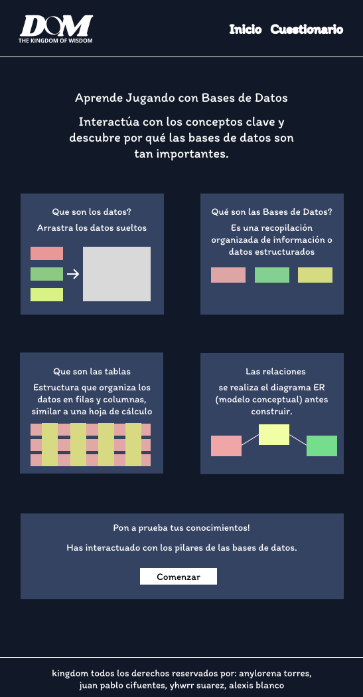
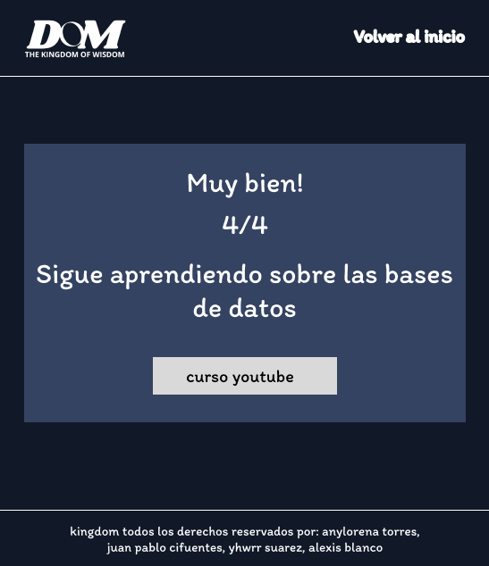
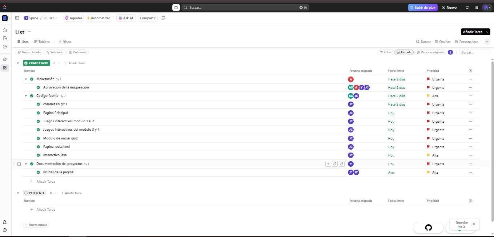

# 👑 KingDom Of WisDom: Aprendizaje Interactivo de Bases de Datos

**KingDom Of WisDom** es un recurso educativo interactivo diseñado para enseñar los fundamentos de las bases de datos de una manera clara, creativa y comprensible. A través de módulos interactivos y un quiz dinámico, los usuarios pueden aprender y poner a prueba sus conocimientos en un entorno amigable y atractivo.
    

### ✍️ Descripción del Proyecto

Este proyecto nace como respuesta a la necesidad de desmitificar los conceptos de bases de datos, que a menudo se perciben como técnicos y complejos. Nuestra solución es una aplicación web de una sola página (SPA) que guía al usuario a través de un viaje de aprendizaje, comenzando con conceptos teóricos presentados en micro-interacciones y culminando en un cuestionario para solidificar el conocimiento adquirido. El enfoque es "aprender haciendo", convirtiendo al usuario de un espectador pasivo a un participante activo.

### 🎯 Objetivo Principal

El objetivo es proporcionar una herramienta didáctica que permita a cualquier persona, sin necesidad de conocimientos previos, entender qué son los datos, qué es una base de datos, cómo se estructuran (tablas, filas, columnas) y cómo se planifican conceptualmente (diagramas ERD).

### ✨ Características Principales

-   **Aprendizaje Interactivo:** Módulos que permiten al usuario "jugar" con los conceptos.
    
    -   **Procesador de Datos:** Arrastra y suelta elementos para ver cómo los datos se convierten en información.
        
    -   **Archivadores Digitales:** Simulación de cómo las bases de datos organizan información en diferentes "gabinetes".
        
    -   **Tabla Interactiva:** Resalta filas y columnas para entender visualmente la estructura de una tabla.
        
    -   **Constructor de Relaciones:** Conecta entidades para comprender los diagramas Entidad-Relación.
        
-   **Quiz Dinámico:** Un cuestionario de 4 preguntas que se desarrolla en la misma página, sin recargas.
    
-   **Retroalimentación Final:** Al terminar el quiz, se muestra una puntuación y un mensaje personalizado.
    
-   **Diseño Moderno y Responsivo:** Interfaz atractiva y totalmente funcional en dispositivos móviles y de escritorio.
    
-   **Experiencia de Usuario Fluida:** Animaciones sutiles y transiciones que hacen la navegación agradable.
    

### 📸 Vistazo a la Aplicación

Aquí puedes ver cómo luce nuestra aplicación.


[**Click AQUÍ**](https://example/)

### 🎨 Diseño y Prototipado (Figma)

Todo el diseño de la interfaz de usuario y la experiencia de usuario (UI/UX) se planificó y prototipó en Figma. 

**Página de Inicio - Módulos Interactivos** 


**Página de Preguntas** 


**Página de Resultado** 


Puedes ver nuestro tablero de diseño en el siguiente enlace:
🔗 [**Ver Prototipo en Figma**](https://www.figma.com/proto/hA6e5SNeSn7MdLrxFxyYBP/proyecto-kingdom?node-id=1-2&t=Rz5OUJsYBzhRcHOt-1)

### 🚀 Tecnologías Utilizadas

| Tecnología | Descripción | 
|---|---|---|
| **HTML5** | Estructura y semántica del contenido de la aplicación web. | 
| **CSS3 (Tailwind CSS)** | Framework CSS para un diseño rápido, moderno y responsivo. | 
| **JavaScript (ES6+)** | Lógica de la aplicación, interactividad, manipulación del DOM y funcionalidad del quiz. | 

### ⚙️ Instalación y Uso

No se requiere una instalación compleja. Al ser un proyecto web estático, solo necesitas seguir estos pasos:

No se requiere una instalación compleja. Al ser un proyecto web estático, solo necesitas seguir estos pasos:

1.  **Clona el repositorio:**
    
    ```
    git clone https://github.com/JuanpaDCS/web-kingdom
    
    
    ```
    
2.  **Link de gitpage:**
    
    ```
 [**Ver Video en Pagina**](https://juanpadcs.github.io/web-kingdom/ "null")
    
        
    ```
    
3.  **Abre el archivo `index.html` en tu navegador web preferido.**
    
### Metodología SCRUM

Para la gestión de este proyecto, utilizamos la metodología ágil SCRUM, organizando nuestro trabajo en Sprints y gestionando las tareas en un tablero de proyecto.

- **Tablero de Proyecto:** 

    

### 🎥 Video Explicativo

En el siguiente video, presentamos al equipo, explicamos el contenido teórico y demostramos el funcionamiento de nuestra aplicación.

▶️ [**Ver Video en YouTube**](https://www.google.com/search?q=%5BAQU%C3%8D_EL_ENLACE_A_TU_VIDEO%5D "null")

### 🧑‍💻 Equipo de Desarrollo


| Integrante | Rol | 
|---|---|---|
| Yhwrr Suárez | Product Owner | 
| Juan Pablo Cifuentes | SCRUM Master -Programador | 
| Anylorena Torres | Diseñadora | 
| Alexis Blanco - Anylorena Torres | Programador | 
